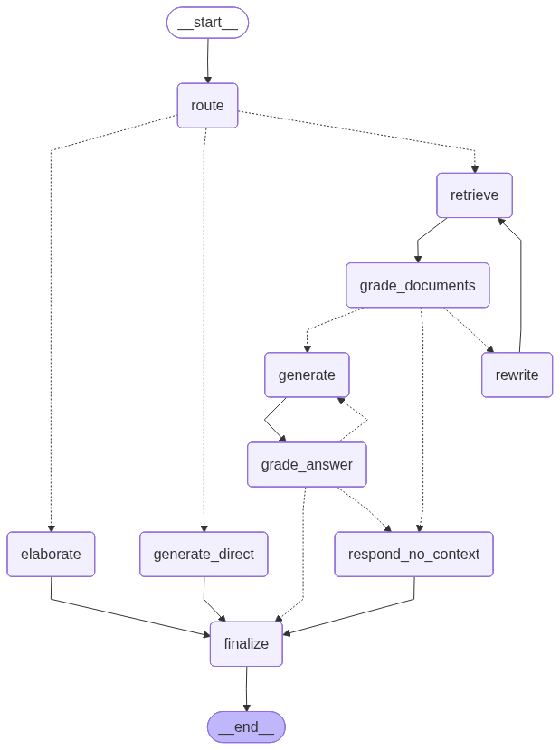

# AI Document Assistant — Agentic RAG for Software Support

A production-grade, **agentic Retrieval-Augmented Generation (RAG)** chatbot that answers questions strictly from your documents — with self-reflection, corrective retrieval, conversation memory, and honest "I don't know" behavior instead of hallucinations.

Built with **LangGraph**, **Google Gemini**, **Qdrant**, **FastAPI** and **Streamlit**, evaluated with **Ragas**, containerized with **Docker**, and continuously deployed to **Google Cloud Run** via **GitHub Actions**.

## Live demo

| Service | URL |
|---|---|
| **Chat UI** | https://rag-ui-l264klroxq-nw.a.run.app |
| **API** | https://rag-api-l264klroxq-nw.a.run.app |

> Upload a document (PDF/TXT/MD/DOCX) in the sidebar, then ask questions about it. The assistant answers in the language of your question and cites its sources.

## Why this project is different

Most RAG demos just do "embed → search → stuff into prompt". This one is an **agent** that makes decisions and checks its own work:

- **Adaptive routing** — classifies each message as `retrieve` (document question), `direct` (greeting/small talk), or `clarify` (user didn't understand) and takes a different path for each.
- **Corrective RAG** — an LLM grades whether retrieved chunks are actually relevant; if not, it **rewrites the query and retries** instead of answering from noise.
- **Self-RAG** — after generating an answer, the agent grades its own answer for **groundedness** (is it supported by the context?) and relevance; if it fails, it regenerates.
- **Knowledge gating on elaboration** — when the user doesn't understand and the documents don't help, the agent may explain from general knowledge **only if confident**, and **explicitly labels** it as general knowledge (not a document fact). After repeated confusion on the same point, it stops rephrasing and shows the **raw source text**.
- **Conversation memory** — per-conversation history with a bounded window (last N messages), plus follow-up **query contextualization** ("what about shipping?" → "what is the shipping policy?").
- **Anti-hallucination by design** — score-thresholded retrieval, grounded-answer grading, and prompts that instruct the model to admit when it doesn't know.

## Architecture

The agent is a **LangGraph state machine**. Each node is a focused step; conditional edges create branching and self-correcting loops.



High-level flow:

```
             ┌── direct ──────────────► generate_direct ─┐
route ───────┼── clarify ─────────────► elaborate ───────┤
             └── retrieve ─► grade_documents              │
                                 │ relevant ─► generate ─► grade_answer ─┐
                                 │ irrelevant ─► rewrite ─► retrieve       │
                                 └─ none ─► respond_no_context ────────────┤
                                                                           ▼
                                                                        finalize ─► END
```

## Tech stack

| Layer | Choice | Why |
|---|---|---|
| Agent orchestration | **LangGraph** | Stateful, multi-step agents with loops and conditional routing |
| LLM | **Gemini 2.5 Flash** | Fast, cheap, multilingual |
| Embeddings | **gemini-embedding-001** (3072-d) | Multilingual, cross-lingual retrieval |
| Vector DB | **Qdrant** (Qdrant Cloud in prod) | Fast similarity + MMR search, managed hosting |
| Retrieval | Similarity w/ score threshold **+ MMR** | Relevance with diversity, tunable per doc type |
| Chunking | Recursive (structured docs) **+ Semantic** | Structure-aware for legal/technical, semantic for prose |
| API | **FastAPI** | Typed, async, auto-docs |
| UI | **Streamlit** | Fast, clean chat interface |
| Evaluation | **Ragas** | Objective quality metrics (Gemini as judge) |
| Packaging | **Docker** / docker-compose | One-command local stack |
| CI/CD | **GitHub Actions → Cloud Run** | Keyless deploy via Workload Identity Federation |

## Evaluation

Quality is measured objectively with [Ragas](https://docs.ragas.io) against a golden dataset (`app/eval/golden_dataset.json`), using Gemini as the judge. Latest run:

| Metric | Score | Meaning |
|---|---|---|
| **Faithfulness** | 1.00 | Answers are fully grounded in retrieved context (no hallucination) |
| **Answer relevancy** | 0.81 | Answers address the question |
| **Context precision** | 0.80 | Retrieved chunks are relevant |
| **Context recall** | 1.00 | Retrieval captures the needed information |

Reproduce:

```bash
python -m app.eval.run_eval   # writes docs/eval_report.md
```

## Project structure

```
app/
  agent/         # LangGraph: state, nodes, graph wiring
  ingestion/     # loaders, chunking, Qdrant vector store, pipeline
  retrieval/     # similarity + MMR search, context/source formatting
  eval/          # Ragas evaluation + golden dataset
  api/           # FastAPI backend (/health, /upload, /chat)
  ui/            # Streamlit chat UI
  config.py      # pydantic-settings configuration
  models.py      # Gemini LLM + embedding factories
.github/workflows/deploy.yml   # CI/CD to Cloud Run
docker-compose.yml             # local API + UI (Qdrant Cloud)
Dockerfile                     # Cloud Run-compatible image
```

## Run locally

### Prerequisites
- Python 3.12+
- A Google AI Studio API key
- A Qdrant instance (local via Docker, or a free Qdrant Cloud cluster)

### 1. Configure
```bash
cp .env.example .env
# edit .env: set GOOGLE_API_KEY and (optionally) QDRANT_URL / QDRANT_API_KEY
```

### 2. Option A — Docker (recommended)
```bash
docker compose up -d --build
# UI:  http://localhost:8501
# API: http://localhost:8080
```

### 2. Option B — Python
```bash
python -m venv venv && source venv/bin/activate
pip install -r requirements.txt

# Optional: local Qdrant
docker run -p 6333:6333 -v "$(pwd)/data/qdrant_storage:/qdrant/storage" qdrant/qdrant

# API
uvicorn app.api.main:app --reload --port 8000
# UI (in another terminal)
streamlit run app/ui/streamlit_app.py
```

## Configuration

| Variable | Description | Default |
|---|---|---|
| `GOOGLE_API_KEY` | Google AI Studio key (required) | — |
| `LLM_MODEL` | Chat model | `gemini-2.5-flash` |
| `EMBEDDING_MODEL` | Embedding model | `models/gemini-embedding-001` |
| `EMBEDDING_DIM` | Embedding dimensions | `3072` |
| `QDRANT_URL` | Qdrant endpoint | `http://localhost:6333` |
| `QDRANT_API_KEY` | Qdrant Cloud key (prod) | empty |
| `QDRANT_COLLECTION` | Collection name | `documents` |

## Deployment

Every push to `main` triggers `.github/workflows/deploy.yml`, which:

1. Authenticates to GCP **keylessly** via Workload Identity Federation.
2. Builds the Docker image and pushes it to **Artifact Registry**.
3. Deploys two **Cloud Run** services — `rag-api` and `rag-ui`.

Secrets (API keys, Qdrant credentials, GCP identity) are stored as GitHub Actions secrets and injected as Cloud Run environment variables. No credentials live in the repo.

## API

| Endpoint | Method | Description |
|---|---|---|
| `/health` | GET | Liveness check |
| `/upload` | POST | Upload & ingest a document (multipart `file`) |
| `/chat` | POST | Ask a question: `{ "question": "...", "thread_id": "..." }` |

Example:

```bash
curl -X POST "$API_URL/chat" \
  -H 'Content-Type: application/json' \
  -d '{"question": "What is the return policy?", "thread_id": "demo"}'
```
